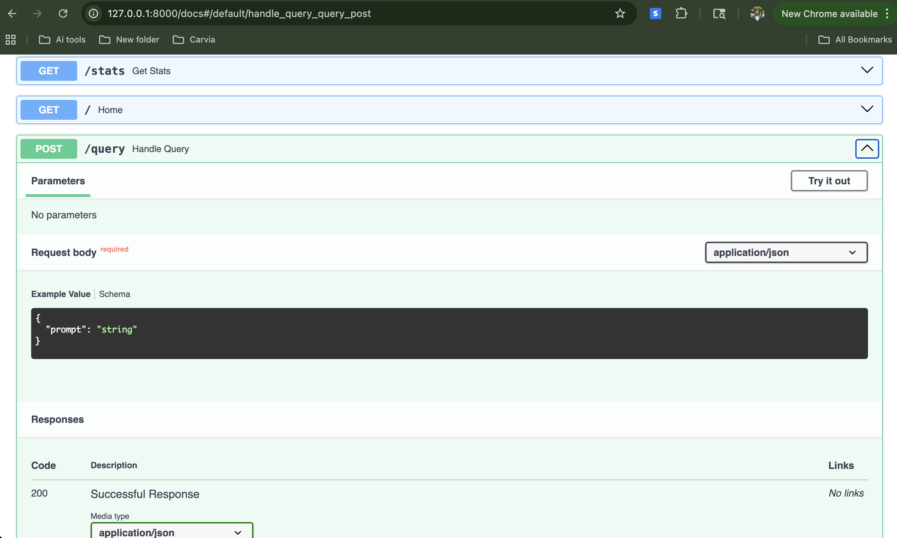
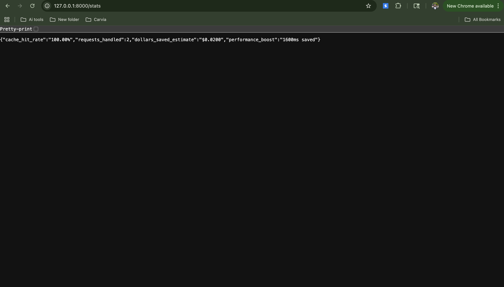

# 🚀 Semantic Router & Cache Layer

A production-grade MLOps utility designed to reduce LLM inference costs and latency. This system intelligently caches query intents using vector similarity and routes complex tasks to high-tier models while handling simple tasks with cost-efficient alternatives.

---

## 💡 Business Impact
*   **Cost Reduction:** Saves up to 90% on repetitive queries by serving answers from the local vector cache.
*   **Latency Optimization:** Reduces response time from ~1.5s (LLM) to <50ms (Cache).
*   **Intelligence:** Automatically scales "Brain Power" (Model Routing) based on the complexity of the user prompt.

## 🏗️ Architecture

1.  **FastAPI:** High-performance asynchronous API framework.
2.  **OpenAI Embeddings:** Converts text into 1536-dimensional vectors.
3.  **Pinecone Vector DB:** Performs semantic similarity searches with a 0.96 threshold.
4.  **Dynamic Router:** Logic-gate that switches between `gpt-4o` (Complex) and `gpt-4o-mini` (Simple).

## 🛠️ Tech Stack
*   **Language:** Python 3.10+
*   **Database:** Pinecone (Serverless)
*   **Models:** OpenAI GPT-4o, GPT-4o-mini, text-embedding-3-small
*   **Tools:** FastAPI, Uvicorn, Pydantic, Python-Dotenv

## 🚀 Getting Started

### 1. Installation
python3 -m venv venv
source venv/bin/activate
pip install -r requirements.txt

### 2. Environment Setup
OPENAI_API_KEY=your_key_here

PINECONE_API_KEY=your_key_here

### 3. Run the Server
python3 -m uvicorn main:app --reload

### 📊 Endpoints
GET /health: Check system and Vector DB status.
GET /stats: View real-time savings, cache hit rates, and latency reduction.
POST /query: The main entry point for semantic routing and caching.

### 📸 Demo Images

### API Documentation (Swagger UI)

### Real-Time Savings Dashboard

